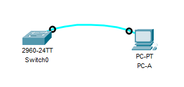
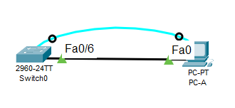

# Лабораторная работа: Базовая настройка коммутатора

## Топология


## Таблица адресации

| Устройство | Интерфейс | IP-адрес / префикс |
|------------|-----------|-------------------|
| S1 | VLAN 1 | 192.168.1.2 /24 |
|  |  | |
| PC-A | NIC | 192.168.1.10 /24 |

## Задачи

### Часть 1. Проверка конфигурации коммутатора по умолчанию

#### Создал сеть согласно топологии. Консольное соединение


```
Switch>enable
Switch#show running-config
Building configuration...

Current configuration : 1080 bytes
!
version 15.0
no service timestamps log datetime msec
no service timestamps debug datetime msec
no service password-encryption
!
hostname Switch
!
!
!
!
!
!
spanning-tree mode pvst
spanning-tree extend system-id
!
interface FastEthernet0/1
!
interface FastEthernet0/2
!
interface FastEthernet0/3
!
interface FastEthernet0/4
!
interface FastEthernet0/5
!
interface FastEthernet0/6
!
interface FastEthernet0/7
!
interface FastEthernet0/8
!
interface FastEthernet0/9
!
interface FastEthernet0/10
!
interface FastEthernet0/11
!
interface FastEthernet0/12
!
interface FastEthernet0/13
!
interface FastEthernet0/14
!
interface FastEthernet0/15
!
interface FastEthernet0/16
!
interface FastEthernet0/17
!
interface FastEthernet0/18
!
interface FastEthernet0/19
!
interface FastEthernet0/20
!
interface FastEthernet0/21
!
interface FastEthernet0/22
!
interface FastEthernet0/23
!
interface FastEthernet0/24
!
interface GigabitEthernet0/1
!
interface GigabitEthernet0/2
!
interface Vlan1
 no ip address
 shutdown
!
!
!
!
line con 0
!
line vty 0 4
 login
line vty 5 15
 login
!
!
!
!
end
```
#### Анализ running configuration

* Количество FastEthernet интерфейсов: 24 (FastEthernet0/1 - FastEthernet0/24)
* Количество GigabitEthernet интерфейсов: 2 (GigabitEthernet0/1 - GigabitEthernet0/2)
* Диапазон vty-линий: 0-15 (line vty 0 4 и line vty 5 15)
* line vty 0 4    ← Линии с номерами 0, 1, 2, 3, 4 (всего 5 линий)
* line vty 5 15   ← Линии с номерами 5, 6, 7, 8, 9, 10, 11, 12, 13, 14, 15 (всего 11 линий)

*Итого: 16 VTY-линий (0-15) = максимум 16 одновременных удаленных подключений*

#### Проверка загрузочной конфигурации
```
Switch#show startup-config
startup-config is not present
```
Это сообщение означает, что файл загрузочной конфигурации отсутствует в энергонезависимой памяти (NVRAM) коммутатора. (новый комутатор)

#### Характеристики SVI для VLAN 1
```
Switch#show interface vlan 1
Vlan1 is administratively down, line protocol is down
  Hardware is CPU Interface, address is 0010.1126.5549 (bia 0010.1126.5549)
  MTU 1500 bytes, BW 100000 Kbit, DLY 1000000 usec,
     reliability 255/255, txload 1/255, rxload 1/255
  Encapsulation ARPA, loopback not set
  ARP type: ARPA, ARP Timeout 04:00:00
  Last input 21:40:21, output never, output hang never
  Last clearing of "show interface" counters never
  Input queue: 0/75/0/0 (size/max/drops/flushes); Total output drops: 0
  Queueing strategy: fifo
  Output queue: 0/40 (size/max)
  5 minute input rate 0 bits/sec, 0 packets/sec
  5 minute output rate 0 bits/sec, 0 packets/sec
     1682 packets input, 530955 bytes, 0 no buffer
     Received 0 broadcasts (0 IP multicast)
     0 runts, 0 giants, 0 throttles
     0 input errors, 0 CRC, 0 frame, 0 overrun, 0 ignored
     563859 packets output, 0 bytes, 0 underruns
     0 output errors, 23 interface resets
     0 output buffer failures, 0 output buffers swapped out

```

IP-адрес не назначен (В выводе нет строки с IP-адресом)

MAC-адрес интерфейса 0010.1126.5549 - указан в строке address is 0010.1126.5549 (bia 0010.1126.5549)

Статус интерфейса (up/down) - Vlan1 is administratively down, line protocol is down 

*administratively down = интерфейс выключен командой shutdown*

*line protocol is down = протокол линии не работает (логично, так как интерфейс выключен)*


#### IP-свойства интерфейса SVI
```
Switch#show ip interface vlan 1
Vlan1 is administratively down, line protocol is down
  Internet protocol processing disabled
```
*Этот вывод показывает IP-статус интерфейса VLAN 1.*

IP-обработка отключена - интерфейс не может обрабатывать IP-пакеты
Это происходит потому, что интерфейс находится в состоянии shutdown

####	Подсоедините кабель Ethernet компьютера PC-A к порту 6 на коммутаторе и изучите IP-свойства интерфейса SVI сети VLAN 1


#### Сведения о версии IOS

```
Switch>show version
Cisco IOS Software, C2960 Software (C2960-LANBASEK9-M), Version 15.0(2)SE4, RELEASE SOFTWARE (fc1)
Technical Support: http://www.cisco.com/techsupport
Copyright (c) 1986-2013 by Cisco Systems, Inc.
Compiled Wed 26-Jun-13 02:49 by mnguyen

ROM: Bootstrap program is C2960 boot loader
BOOTLDR: C2960 Boot Loader (C2960-HBOOT-M) Version 12.2(25r)FX, RELEASE SOFTWARE (fc4)

Switch uptime is 39 minutes
System returned to ROM by power-on
System image file is "flash:c2960-lanbasek9-mz.150-2.SE4.bin"


This product contains cryptographic features and is subject to United
States and local country laws governing import, export, transfer and
use. Delivery of Cisco cryptographic products does not imply
third-party authority to import, export, distribute or use encryption.
Importers, exporters, distributors and users are responsible for
compliance with U.S. and local country laws. By using this product you
agree to comply with applicable laws and regulations. If you are unable
to comply with U.S. and local laws, return this product immediately.

A summary of U.S. laws governing Cisco cryptographic products may be found at:
http://www.cisco.com/wwl/export/crypto/tool/stqrg.html

If you require further assistance please contact us by sending email to
export@cisco.com.

cisco WS-C2960-24TT-L (PowerPC405) processor (revision B0) with 65536K bytes of memory.
Processor board ID FOC1010X104
Last reset from power-on
1 Virtual Ethernet interface
24 FastEthernet interfaces
2 Gigabit Ethernet interfaces
The password-recovery mechanism is enabled.

64K bytes of flash-simulated non-volatile configuration memory.
Base ethernet MAC Address       : 00:10:11:26:55:49
Motherboard assembly number     : 73-10390-03
Power supply part number        : 341-0097-02
Motherboard serial number       : FOC10093R12
Power supply serial number      : AZS1007032H
Model revision number           : B0
Motherboard revision number     : B0
Model number                    : WS-C2960-24TT-L
System serial number            : FOC1010X104
Top Assembly Part Number        : 800-27221-02
Top Assembly Revision Number    : A0
Version ID                      : V02
CLEI Code Number                : COM3L00BRA
Hardware Board Revision Number  : 0x01


Switch Ports Model              SW Version            SW Image
------ ----- -----              ----------            ----------
*    1 26    WS-C2960-24TT-L    15.0(2)SE4            C2960-LANBASEK9-M


Configuration register is 0xF
```

Версию Cisco IOS - Version 15.0(2)SE4

Имя файла образа системы - flash:c2960-lanbasek9-mz.150-2.SE4.bin

#### Свойства интерфейса FastEthernet 0/6

```
Switch>show interface f0/6
FastEthernet0/6 is up, line protocol is up (connected)
  Hardware is Lance, address is 0001.641d.8606 (bia 0001.641d.8606)
 BW 100000 Kbit, DLY 1000 usec,
     reliability 255/255, txload 1/255, rxload 1/255
  Encapsulation ARPA, loopback not set
  Keepalive set (10 sec)
  Full-duplex, 100Mb/s
  input flow-control is off, output flow-control is off
  ARP type: ARPA, ARP Timeout 04:00:00
  Last input 00:00:08, output 00:00:05, output hang never
  Last clearing of "show interface" counters never
  Input queue: 0/75/0/0 (size/max/drops/flushes); Total output drops: 0
  Queueing strategy: fifo
  Output queue :0/40 (size/max)
  5 minute input rate 0 bits/sec, 0 packets/sec
  5 minute output rate 0 bits/sec, 0 packets/sec
     956 packets input, 193351 bytes, 0 no buffer
     Received 956 broadcasts, 0 runts, 0 giants, 0 throttles
     0 input errors, 0 CRC, 0 frame, 0 overrun, 0 ignored, 0 abort
     0 watchdog, 0 multicast, 0 pause input
     0 input packets with dribble condition detected
     2357 packets output, 263570 bytes, 0 underruns
     0 output errors, 0 collisions, 10 interface resets
     0 babbles, 0 late collision, 0 deferred
     0 lost carrier, 0 no carrier
     0 output buffer failures, 0 output buffers swapped out
```
Статус интерфейса (up/down) - FastEthernet0/6 is up, line protocol is up (connected)

MAC-адрес - 0001.641d.8606

Настройки speed и duplex - Full-duplex, 100Mb/s

Интерфейс уже включен и работает нормально.
Если бы интерфейс был выключен, то для включения нужно было бы:

```
Switch(config)# interface fastethernet 0/6
Switch(config-if)# no shutdown
```

#### Содержимое флеш-памяти

```
Switch>show flash
Directory of flash:/

    1  -rw-     4670455          <no date>  2960-lanbasek9-mz.150-2.SE4.bin

64016384 bytes total (59345929 bytes free)
```
Имя файла образа Cisco IOS - 2960-lanbasek9-mz.150-2.SE4.bin

### Часть 2. Создание сети и настройка основных параметров устройства
- Настройте базовые параметры коммутатора
- Настройте IP-адрес для ПК

#### Отобразите конфигурацию коммутатора

Согласно документу, нужно в режиме глобальной конфигурации скопировать следующие базовые параметры:
```
Switch#configure terminal
Enter configuration commands, one per line.  End with CNTL/Z.
Switch(config)#no ip domain-lookup
Switch(config)#hostname S1
S1(config)#service password-encryption
S1(config)#enable secret class
S1(config)#banner motd #Unauthorized access is strictly prohibited. #
```
Назначьте IP-адрес интерфейсу SVI
Согласно таблице адресации, нужно назначить IP-адрес 192.168.1.2/24 для VLAN 1:
```
S1(config)#interface vlan 1
S1(config-if)#ip address 192.168.1.2 255.255.255.0
S1(config-if)#no shutdown

S1(config-if)#
%LINK-5-CHANGED: Interface Vlan1, changed state to up

%LINEPROTO-5-UPDOWN: Line protocol on Interface Vlan1, changed state to up
S1(config-if)#exit
```
Настройте доступ через консольный порт:
```
S1(config-if)#exit
S1(config)#line con 0
S1(config-line)#password cisco
S1(config-line)#login
S1(config-line)#loggin sy
S1(config-line)#loggin synchronous 
S1(config-line)#exit
```
Настройте каналы VTY для удаленного управления:

```
S1(config)#line vty 0 15
S1(config-line)#password cisco
S1(config-line)#login
S1(config-line)#exit
S1(config)#exit
S1#
%SYS-5-CONFIG_I: Configured from console by console
```
 *login -  Включает требование ввода пароля при подключении. Без этой команды пароль установлен, но не будет запрашиваться!*


### Часть 3. Проверка сетевых подключений
- Отобразите конфигурацию устройства
- Протестируйте сквозное соединение, отправив эхо-запрос
- Протестируйте возможности удаленного управления с помощью Telnet

#### Проверка текущей конфигурации:
```
S1#show run
Building configuration...

Current configuration : 1317 bytes
!
version 15.0
no service timestamps log datetime msec
no service timestamps debug datetime msec
service password-encryption
!
hostname S1
!
enable secret 5 $1$mERr$9cTjUIEqNGurQiFU.ZeCi1
!
!
!
no ip domain-lookup
!
!
!
spanning-tree mode pvst
spanning-tree extend system-id
!
interface FastEthernet0/1
!
interface FastEthernet0/2
!
interface FastEthernet0/3
!
interface FastEthernet0/4
!
interface FastEthernet0/5
!
interface FastEthernet0/6
!
interface FastEthernet0/7
!
interface FastEthernet0/8
!
interface FastEthernet0/9
!
interface FastEthernet0/10
!
interface FastEthernet0/11
!
interface FastEthernet0/12
!
interface FastEthernet0/13
!
interface FastEthernet0/14
!
interface FastEthernet0/15
!
interface FastEthernet0/16
!
interface FastEthernet0/17
!
interface FastEthernet0/18
!
interface FastEthernet0/19
!
interface FastEthernet0/20
!
interface FastEthernet0/21
!
interface FastEthernet0/22
!
interface FastEthernet0/23
!
interface FastEthernet0/24
!
interface GigabitEthernet0/1
!
interface GigabitEthernet0/2
!
interface Vlan1
 ip address 192.168.1.2 255.255.255.0
!
banner motd ^CUnauthorized access is strictly prohibited. ^C
!
!
!
line con 0
 password 7 0822455D0A16
 logging synchronous
 login
!
line vty 0 4
 password 7 0822455D0A16
 login
line vty 5 15
 password 7 0822455D0A16
 login
!
!
!
!
end
```
**Проверенные настроенные параметры:**
- ✓ Hostname: S1
- ✓ Шифрование паролей включено
- ✓ Enable secret установлен
- ✓ DNS lookup отключен  
- ✓ Banner MOTD настроен
- ✓ VLAN 1: IP 192.168.1.2/24
- ✓ Консольный доступ: пароль cisco, logging synchronous
- ✓ VTY доступ: пароль cisco на линиях 0-15


#### Параметры VLAN 1:

```
S1#show interface vlan 1
Vlan1 is up, line protocol is up
  Hardware is CPU Interface, address is 0010.1126.5549 (bia 0010.1126.5549)
  Internet address is 192.168.1.2/24
  MTU 1500 bytes, BW 100000 Kbit, DLY 1000000 usec,
     reliability 255/255, txload 1/255, rxload 1/255
  Encapsulation ARPA, loopback not set
  ARP type: ARPA, ARP Timeout 04:00:00
  Last input 21:40:21, output never, output hang never
  Last clearing of "show interface" counters never
  Input queue: 0/75/0/0 (size/max/drops/flushes); Total output drops: 0
  Queueing strategy: fifo
  Output queue: 0/40 (size/max)
  5 minute input rate 0 bits/sec, 0 packets/sec
  5 minute output rate 0 bits/sec, 0 packets/sec
     1682 packets input, 530955 bytes, 0 no buffer
     Received 0 broadcasts (0 IP multicast)
     0 runts, 0 giants, 0 throttles
     0 input errors, 0 CRC, 0 frame, 0 overrun, 0 ignored
     563859 packets output, 0 bytes, 0 underruns
     0 output errors, 23 interface resets
     0 output buffer failures, 0 output buffers swapped out
```

Полоса пропускания  VLAN 1 100000 Kbit (100 Мбит/с)

#### Тестирование сквозного соединения

Проверка связи c PC-A:
```
S1#ping 192.168.1.10

Type escape sequence to abort.
Sending 5, 100-byte ICMP Echos to 192.168.1.10, timeout is 2 seconds:
!!!!!
Success rate is 100 percent (5/5), round-trip min/avg/max = 0/0/0 ms

```


Проверка связи с коммутатором S1:
```
C:\>ping 192.168.1.2

Pinging 192.168.1.2 with 32 bytes of data:

Reply from 192.168.1.2: bytes=32 time<1ms TTL=255
Reply from 192.168.1.2: bytes=32 time<1ms TTL=255
Reply from 192.168.1.2: bytes=32 time<1ms TTL=255
Reply from 192.168.1.2: bytes=32 time<1ms TTL=255

Ping statistics for 192.168.1.2:
    Packets: Sent = 4, Received = 4, Lost = 0 (0% loss),
Approximate round trip times in milli-seconds:
    Minimum = 0ms, Maximum = 0ms, Average = 0ms
```

#### Проверка удаленного управления коммутатором S1:
```
C:\>telnet 192.168.1.2
Trying 192.168.1.2 ...OpenUnauthorized access is strictly prohibited. 


User Access Verification

Password: 
S1>enable
Password: 
S1#copy running-config startup-config
Destination filename [startup-config]? 
Building configuration...
[OK]
S1#exit

[Connection to 192.168.1.2 closed by foreign host]
```
Вопросы:

Зачем необходимо настраивать пароль VTY для коммутатора?

-Без пароля VTY подключение по Telnet/SSH невозможно.

Что нужно сделать, чтобы пароли не отправлялись в незашифрованном виде?

-Включить шифрование паролей: service password-encryption. Использовать SSH вместо. Telnet: SSH шифрует весь трафик сессии