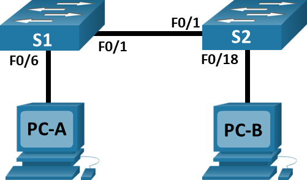
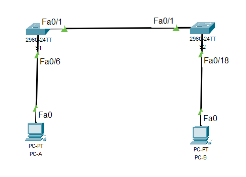
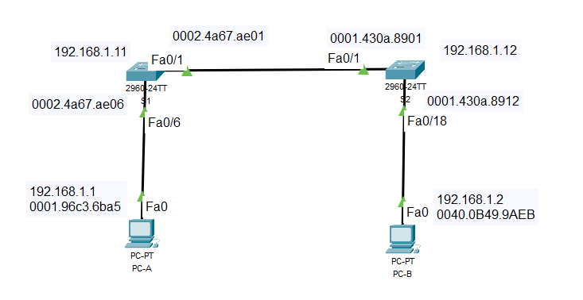

# Лабораторная работа: Просмотр таблицы MAC-адресов коммутатора

## Топология



Сеть состоит из двух коммутаторов (S1 и S2) и двух ПК (PC-A и PC-B):
- PC-A подключен к S1 через порт F0/6  
- S1 F0/1 соединен с S2 F0/1
- PC-B подключен к S2 через порт F0/18

## Таблица адресации

| Устройство | Интерфейс | IP-адрес      | Маска подсети   |
|------------|-----------|---------------|-----------------|
| S1         | VLAN 1    | 192.168.1.11  | 255.255.255.0  |
| S2         | VLAN 1    | 192.168.1.12  | 255.255.255.0  |
| PC-A       | NIC       | 192.168.1.1   | 255.255.255.0  |
| PC-B       | NIC       | 192.168.1.2   | 255.255.255.0  |

## Часть 1: Создание и настройка сети

### Шаг 1: Создание топологии
Создана топология в Cisco Packet Tracer согласно схеме с использованием коммутаторов 2960 и ПК.

### Шаг 2: Настройка узлов ПК

**Настройка PC-A:**
- IP-адрес: 192.168.1.1
- Маска подсети: 255.255.255.0

**Настройка PC-B:**
- IP-адрес: 192.168.1.2  
- Маска подсети: 255.255.255.0

### Шаг 3: Настройка коммутаторов

**Настройка коммутатора S1:**
```
Switch>enable
Switch#configure terminal
Switch(config)#hostname S1
S1(config)#interface vlan 1
S1(config-if)#ip address 192.168.1.11 255.255.255.0
S1(config-if)#no shutdown
S1(config-if)#exit
S1(config)#line console 0
S1(config-line)#password cisco
S1(config-line)#login
S1(config-line)#exit
S1(config)#line vty 0 15
S1(config-line)#password cisco
S1(config-line)#login
S1(config-line)#exit
S1(config)#enable secret class
S1(config)#exit
S1#copy running-config startup-config
```

**Настройка коммутатора S2:**
```
Switch>enable
Switch#configure terminal
Switch(config)#hostname S2
S2(config)#interface vlan 1
S2(config-if)#ip address 192.168.1.12 255.255.255.0
S2(config-if)#no shutdown
S2(config-if)#exit
S2(config)#line console 0
S2(config-line)#password cisco
S2(config-line)#login
S2(config-line)#exit
S2(config)#line vty 0 15
S2(config-line)#password cisco
S2(config-line)#login
S2(config-line)#exit
S2(config)#enable secret class
S2(config)#exit
S2#copy running-config startup-config
```

## Часть 2: Изучение таблицы MAC-адресов коммутатора

### Шаг 1: Запись MAC-адресов сетевых устройств

**MAC-адреса компьютеров:**

**PC-A:**
```
C:\>ipconfig /all
FastEthernet0 Connection:(default port)
Physical Address................: 0001.96C3.6BA5
IPv4 Address....................: 192.168.1.1
Subnet Mask.....................: 255.255.255.0
```
**MAC-адрес PC-A:** 0001.96C3.6BA5

**PC-B:**
```
C:\>ipconfig /all
FastEthernet0 Connection:(default port)
Physical Address................: 0040.0B49.9AEB
IPv4 Address....................: 192.168.1.2
Subnet Mask.....................: 255.255.255.0
```
**MAC-адрес PC-B:** 0040.0B49.9AEB

**MAC-адреса коммутаторов:**

**S1 FastEthernet 0/1:**
```
S1>show interface F0/1
FastEthernet0/1 is up, line protocol is up (connected)
Hardware is Lance, address is 0002.4a67.ae01 (bia 0002.4a67.ae01)
```
**MAC-адрес S1 F0/1:** 0002.4a67.ae01

**S2 FastEthernet 0/1:**
```
S2#show interface F0/1
FastEthernet0/1 is up, line protocol is up (connected)
Hardware is Lance, address is 0001.430a.8901 (bia 0001.430a.8901)
```
**MAC-адрес S2 F0/1:** 0001.430a.8901

### Шаг 2: Просмотр таблицы MAC-адресов коммутатора

**Начальное состояние таблицы MAC-адресов на S2:**
```
S2#show mac address-table
Mac Address Table
-------------------------------------------
Vlan    Mac Address       Type        Ports
----    -----------       --------    -----
   1    0002.4a67.ae01    DYNAMIC     Fa0/1
```

**Вопросы и ответы:**

**Вопрос:** Записаны ли в таблице МАС-адресов какие-либо МАС-адреса?  
**Ответ:** Да, в таблице MAC-адресов записан один MAC-адрес: 0002.4a67.ae01

**Вопрос:** Какие МАС-адреса записаны в таблице? С какими портами коммутатора они сопоставлены и каким устройствам принадлежат?  
**Ответ:** MAC-адрес 0002.4a67.ae01 сопоставлен с портом Fa0/1 и принадлежит коммутатору S1

**Вопрос:** Если вы не записали МАС-адреса сетевых устройств в шаге 1, как можно определить, каким устройствам принадлежат МАС-адреса, используя только выходные данные команды show mac address-table?  
**Ответ:** Можно определить принадлежность по порту подключения - устройство, подключенное к порту Fa0/1, это коммутатор S1.

### Шаг 3: Очистка таблицы MAC-адресов

**Очистка и повторный просмотр:**
```
S2#clear mac address-table dynamic
S2#show mac address-table
Mac Address Table
-------------------------------------------
Vlan    Mac Address       Type        Ports
----    -----------       --------    -----
   1    0002.4a67.ae01    DYNAMIC     Fa0/1
```

**Через 10 секунд:**
```
S2#show mac address-table
Mac Address Table
-------------------------------------------
Vlan    Mac Address       Type        Ports
----    -----------       --------    -----
   1    0002.4a67.ae01    DYNAMIC     Fa0/1
```

**Вопросы и ответы:**

**Вопрос:** Указаны ли в таблице МАС-адресов адреса для VLAN 1? Указаны ли другие МАС-адреса?  
**Ответ:** Да, в таблице MAC-адресов указан адрес для VLAN 1 (0002.4a67.ae01). Других MAC-адресов не указано.

**Вопрос:** Через 10 секунд введите команду show mac address-table и нажмите клавишу ввода. Появились ли в таблице МАС-адресов новые адреса?  
**Ответ:** Нет, новые адреса не появились. MAC-адрес S1 остался в таблице.

### Шаг 4: Тестирование сетевой связи

**Проверка ARP-таблицы PC-B до отправки ping:**
```
C:\>arp -a
No ARP Entries Found
```
**Вопрос:** Не считая адресов многоадресной и широковещательной рассылки, сколько пар IP- и МАС-адресов устройств было получено через протокол ARP?  
**Ответ:** 0 (ноль) пар IP-MAC адресов - ARP-таблица пуста

**Отправка ping-запросов с PC-B:**

**Ping на PC-A (192.168.1.1):**
```
C:\>ping 192.168.1.1
Pinging 192.168.1.1 with 32 bytes of data:
Reply from 192.168.1.1: bytes=32 time<1ms TTL=128
Reply from 192.168.1.1: bytes=32 time<1ms TTL=128
Reply from 192.168.1.1: bytes=32 time<1ms TTL=128
Reply from 192.168.1.1: bytes=32 time<1ms TTL=128

Ping statistics for 192.168.1.1:
    Packets: Sent = 4, Received = 4, Lost = 0 (0% loss)
```

**Ping на S1 (192.168.1.11):**
```
C:\>ping 192.168.1.11
Pinging 192.168.1.11 with 32 bytes of data:
Request timed out.
Reply from 192.168.1.11: bytes=32 time<1ms TTL=255
Reply from 192.168.1.11: bytes=32 time=3ms TTL=255
Reply from 192.168.1.11: bytes=32 time<1ms TTL=255

Ping statistics for 192.168.1.11:
    Packets: Sent = 4, Received = 3, Lost = 1 (25% loss)
```

**Ping на S2 (192.168.1.12):**
```
C:\>ping 192.168.1.12
Pinging 192.168.1.12 with 32 bytes of data:
Request timed out.
Reply from 192.168.1.12: bytes=32 time<1ms TTL=255
Reply from 192.168.1.12: bytes=32 time<1ms TTL=255
Reply from 192.168.1.12: bytes=32 time<1ms TTL=255

Ping statistics for 192.168.1.12:
    Packets: Sent = 4, Received = 3, Lost = 1 (25% loss)
```

**Вопрос:** От всех ли устройств получены ответы? Если нет, проверьте кабели и IP-конфигурации.  
**Ответ:** От всех устройств получены ответы. Первые пакеты в ping-тестах коммутаторов не прошли из-за времени, необходимого для выполнения ARP-запросов, что является нормальным поведением.

### Шаг 5: Анализ изменений после ping-тестов

**Обновленная таблица MAC-адресов на S2:**
```
S2#show mac address-table
Mac Address Table
-------------------------------------------
Vlan    Mac Address       Type        Ports
----    -----------       --------    -----
   1    0001.96c3.6ba5    DYNAMIC     Fa0/1
   1    0002.4a67.ae01    DYNAMIC     Fa0/1
   1    0040.0b49.9aeb    DYNAMIC     Fa0/18
   1    00d0.5811.2c52    DYNAMIC     Fa0/1
```

**Вопрос:** Добавил ли коммутатор в таблицу МАС-адресов дополнительные МАС-адреса? Если да, то какие адреса и устройства?  
**Ответ:** Да, коммутатор добавил дополнительные MAC-адреса:
- 0001.96c3.6ba5 (PC-A) изучен через порт Fa0/1
- 0040.0b49.9aeb (PC-B) изучен через порт Fa0/18  
- 00d0.5811.2c52 (VLAN интерфейс S1) изучен через порт Fa0/1

**ARP-таблица PC-B после ping-тестов:**
```
C:\>arp -a
Internet Address      Physical Address      Type
192.168.1.1          0001.96c3.6ba5        dynamic
192.168.1.11         00d0.5811.2c52        dynamic
192.168.1.12         0004.9acb.959b        dynamic
```

**Вопрос:** Появились ли в ARP-кэше компьютера PC-B дополнительные записи для всех сетевых устройств, которым были отправлены эхо-запросы?  
**Ответ:** Да, в ARP-таблице PC-B появились записи для всех устройств, которым были отправлены ping-запросы:
- 192.168.1.1 - 0001.96c3.6ba5 (PC-A)
- 192.168.1.11 - 00d0.5811.2c52 (S1)  
- 192.168.1.12 - 0004.9acb.959b (S2)

## Вопрос для повторения

В крупных сетях могут возникнуть следующие сложности:

1. **Ограниченный размер таблиц MAC-адресов** - коммутаторы имеют ограниченную память для хранения MAC-адресов
2. **Устаревание записей** - в больших сетях сложнее отслеживать актуальность MAC-адресов
3. **MAC-флуд атаки** - злоумышленники могут переполнить таблицу MAC-адресов
4. **Широковещательный трафик** - при неизвестных MAC-адресах увеличивается широковещательный трафик
5. **Безопасность** - сложнее контролировать и ограничивать доступ устройств
6. **Производительность** - обработка большого количества MAC-адресов может снизить производительность коммутатора

## Заключение
**Файл конфигурации Packet Tracer:** [Lab2_Viewing_the switch's_MAC_address_table.pkt](Lab2_Viewing_the%20switch's_MAC_address_table.pkt)


В ходе лабораторной работы было изучено, как коммутаторы строят и используют таблицы MAC-адресов для пересылки кадров Ethernet. Показано, как коммутатор изучает MAC-адреса источников и сопоставляет их с портами, а также как происходит пересылка кадров на основе этой информации.